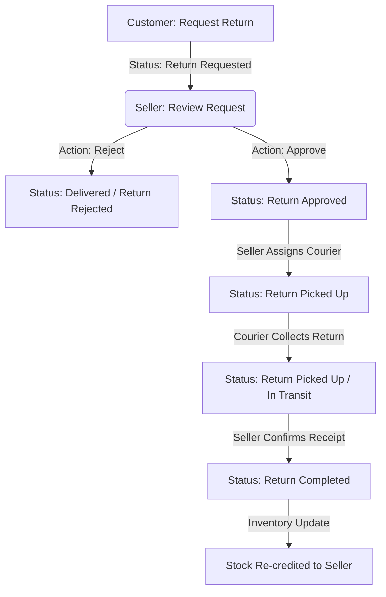

# Project Velos 🚀

Project Velos is a state-of-the-art, **Multi-Vendor Full-Stack E-Commerce Platform** designed to connect Customers, Sellers, and Delivery Partners into a single, cohesive marketplace.

The system features robust authentication, inventory controls, order tracking, real-time logistics management, and an intelligent **AI/ML Product Recommendation Microservice** running alongside the main application.

---

## 🏗️ System Architecture & Tech Stack

The application is structured as a professional, microservice-inspired monorepo consisting of three primary components:

### 🖥️ Frontend
*   **Framework:** React 18 (Vite)
*   **Styling:** Tailwind CSS & PostCSS
*   **Routing:** React Router DOM (v6)
*   **HTTP Client:** Axios (for API communication)

### ⚙️ Backend Gateway
*   **Runtime Environment:** Node.js & Express
*   **Database:** MongoDB with Mongoose ODM
*   **Authentication:** JSON Web Tokens (JWT) & bcryptjs for password hashing
*   **File Storage:** Cloudinary API integration for seamless product & avatar uploads
*   **Communication:** Native global HTTP `fetch` to query the Python ML Microservice

### 🧠 ML Recommendation Service
*   **Framework:** FastAPI & Uvicorn (high-performance async web framework)
*   **Language:** Python 3.8+
*   **Data Stack:** PyMongo, Pandas, NumPy
*   **Algorithms:**
    *   **Market Basket Analysis (Apriori Co-occurrence):** Analyzes historical transactions to find products frequently bought together.
    *   **K-Nearest Neighbors (KNN):** Computes a weighted Euclidean similarity distance over normalized category, brand, price, and average ratings to suggest matching products.

---

## 🌟 Key Features

### 👤 Customer (User) Portal
*   **Secure Authentication:** Signup, login, and profile/password management.
*   **Cart & Wishlist:** Real-time cart addition/removal and persistent wishlist tracking.
*   **Order Placement:** Seamless checkout, automatic stock decrementing, and commission calculation.
*   **AI Recommendations:** View **"Frequently Bought Together"** combos and **"Products You May Also Like"** similarity sliders on product pages.
*   **Reviews & Ratings:** Add reviews for products only *after* they have been successfully delivered.
*   **Logistics Tracking & Returns:** Real-time visibility into shipping status updates and return processing.

### 🏪 Seller Dashboard
*   **Inventory & Product Catalog:** Create, read, update, and soft-delete products.
*   **Analytics Engine:** Automated dashboard showcasing total revenue, cost analysis, net profit, item sales velocity, and returns count.
*   **Returns Manager:** Review pending return requests, approve/reject returns, and assign delivery partners for return pickups.

### 🚚 Delivery Partner System
*   **Assignment Logs:** Dedicated queue showing assigned shipments, seller warehouse locations (shop address), and customer shipping details.
*   **Delivery Lifecycle Updates:** Move shipping statuses through `Picked Up` ➡️ `In Transit` ➡️ `Delivered to Customer`.
*   **Return Pickup Logistics:** Handles return item collection once approved by the seller.

---

## 🔄 Product Return Lifecycle Workflow

Project Velos features an advanced return tracking workflow managed across all three user roles:



---

## 🚦 Getting Started

### 📋 Prerequisites
*   [Node.js](https://nodejs.org/) (v18+ recommended)
*   [Python 3.8+](https://www.python.org/)
*   [MongoDB](https://www.mongodb.com/) (Local instance or Atlas cloud cluster)
*   [Cloudinary Account](https://cloudinary.com/) (For product images)

---

### 🔧 Installation & Setup

#### 1. Clone the Repository
```bash
git clone <repository-url>
cd Project
```

#### 2. Configure the Backend Gateway
*   Navigate to the `Backend` directory:
    ```bash
    cd Backend
    ```
*   Install dependencies:
    ```bash
    npm install
    ```
*   Create a `.env` file based on `.env.example`:
    ```bash
    cp .env.example .env
    ```
*   Ensure `.env` contains:
    ```env
    PORT=5000
    MONGO_URI=mongodb://127.0.0.1:27017/eCommerce
    JWT_SECRET=your_jwt_secret_here
    ML_SERVICE_URL=http://localhost:8000
    ```

#### 3. Configure the ML Recommendation Service
*   Navigate to the `MlServices` directory:
    ```bash
    cd ../MlServices
    ```
*   Create a Python virtual environment:
    ```bash
    python -m venv venv
    ```
*   Install Python dependencies:
    *   **Windows:**
        ```powershell
        .\venv\Scripts\pip install -r requirements.txt
        ```
    *   **Mac/Linux:**
        ```bash
        source venv/bin/activate
        pip install -r requirements.txt
        ```
*   Create a `.env` file containing:
    ```env
    MONGO_URI=mongodb://127.0.0.1:27017/eCommerce
    PORT=8000
    ```

#### 4. Configure the Frontend
*   Navigate to the `Frontend` directory:
    ```bash
    cd ../Frontend
    ```
*   Install frontend dependencies:
    ```bash
    npm install
    ```

---

## 🏃 Running the Application

For a fully functional local development environment, run the backend, frontend, and ML service in parallel:

### 1. Launch the ML Service
From the `MlServices` folder:
*   **Windows:**
    ```powershell
    .\venv\Scripts\python -m uvicorn app.main:app --port 8000 --reload
    ```
*   **Mac/Linux:**
    ```bash
    source venv/bin/activate
    uvicorn app.main:app --port 8000 --reload
    ```
*The ML API server will boot at `http://localhost:8000`. Test algorithms in the Swagger dashboard at `http://localhost:8000/docs`.*

### 2. Launch the Backend Server
From the `Backend` folder:
```bash
npm run dev
```
*The API gateway will launch locally on `http://localhost:5000`*.

### 3. Launch the Frontend Dev Server
From the `Frontend` folder:
```bash
npm run dev
```
*The Vite development server will open the application in your browser (usually `http://localhost:5173`)*.

---

## 📂 Project Directory Structure

```text
Project/
├── Backend/                 # Express API Gateway Proxy
│   ├── src/
│   │   ├── config/          # Database & Cloudinary config
│   │   ├── controllers/     # Controller logic (Users, Sellers, Recommendations)
│   │   ├── middleware/      # Auth & file upload filters
│   │   ├── models/          # Mongoose database schemas
│   │   ├── routes/          # Express API endpoints
│   │   └── server.js        # Main gateway runner
│   └── .env
├── Frontend/                # React SPA Client UI
│   ├── src/
│   │   ├── components/      # Shared React widgets
│   │   ├── pages/           # Customer, Seller, Delivery and Admin views
│   │   └── App.jsx          # Front-end router & setup
│   └── package.json
├── MlServices/              # Standalone Python Recommendation Microservice
│   ├── app/
│   │   ├── models/          # KNN & Apriori algorithms implementation
│   │   ├── database.py      # PyMongo connection layer
│   │   └── main.py          # FastAPI application routes
│   ├── requirements.txt     # Python libraries
│   └── .env                 # Port & MongoDB configurations
├── .gitignore               # Global git ignore file
└── README.md                # System documentation
```
