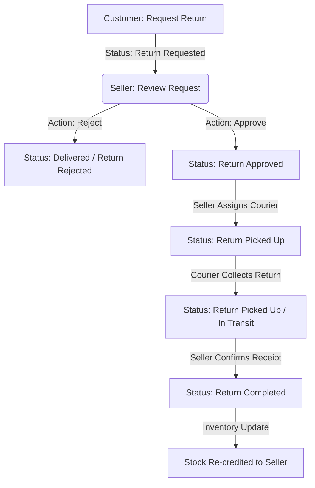

# Project Velos 🚀

Project Velos is a state-of-the-art, **Multi-Vendor Full-Stack E-Commerce Platform** designed to connect Customers, Sellers, and Delivery Partners into a single, cohesive marketplace.

The system features robust authentication, inventory controls, order tracking, real-time logistics management, and a complete end-to-end **Product Return Lifecycle**.

---

## 🏗️ System Architecture & Tech Stack

The application is structured as a monorepo consisting of two primary components:

### 🖥️ Frontend
*   **Framework:** React 18 (Vite)
*   **Styling:** Tailwind CSS & PostCSS
*   **Routing:** React Router DOM (v6)
*   **HTTP Client:** Axios (for API communication)

### ⚙️ Backend
*   **Runtime Environment:** Node.js & Express
*   **Database:** MongoDB with Mongoose ODM
*   **Authentication:** JSON Web Tokens (JWT) & bcryptjs for password hashing
*   **File Storage:** Cloudinary API integration for seamless product & avatar uploads
*   **Middleware:** Multer (multipart form handling) & CORS

---

## 🌟 Key Features

### 👤 Customer (User) Portal
*   **Secure Authentication:** Signup, login, and profile/password management.
*   **Cart & Wishlist:** Real-time cart addition/removal and persistent wishlist tracking.
*   **Order Placement:** Seamless checkout, automatic stock decrementing, and commission calculation.
*   **Reviews & Ratings:** Add reviews for products only *after* they have been successfully delivered.
*   **Logistics Tracking:** Real-time visibility into shipping status updates.
*   **Product Returns:** Initiate return requests with specific reasons.

### 🏪 Seller Dashboard
*   **Inventory & Product Catalog:** Create, read, update, and soft-delete products.
*   **Analytics Engine:** Automated dashboard showcasing total revenue, cost analysis, net profit, item sales velocity, and returns count.
*   **Returns Manager:** Review pending return requests, approve/reject returns, and assign delivery partners for return pickups.

### 🚚 Delivery Partner System
*   **Assignment Logs:** Dedicated queue showing assigned shipments, seller warehouse locations (shop address), and customer shipping details.
*   **Delivery Lifecycle Updates:** Move shipping statuses through `Picked Up` ➡️ `In Transit` ➡️ `Delivered to Customer`.
*   **Return Pickup Logistics:** Handles return item collection once approved by the seller.

---

## 🔄 Product Return Lifecycle Workflow

Project Velos features an advanced return tracking workflow managed across all three user roles:



1.  **Request Return (Customer):** The customer requests a return on a delivered order. The order's status changes to `Return Requested`.
2.  **Evaluate (Seller):** The seller can either `Reject` (reverts status to `Delivered`) or `Approve` the return (updates status to `Return Approved` and automatically replenishes product stock).
3.  **Logistics (Delivery Partner):** The seller assigns an active delivery partner to collect the item. The status moves to `Return Picked Up`.
4.  **Completion (Seller/System):** Once received, the return is marked as `Return Completed`.

---

## 🚦 Getting Started

### 📋 Prerequisites
*   [Node.js](https://nodejs.org/) (v16+ recommended)
*   [MongoDB](https://www.mongodb.com/) (Local instance or Atlas cloud cluster)
*   [Cloudinary Account](https://cloudinary.com/) (For product images)

### 🔧 Installation & Setup

1. **Clone the Repository:**
   ```bash
   git clone <repository-url>
   cd Project
   ```

2. **Configure the Backend:**
   * Navigate to the `Backend` directory:
     ```bash
     cd Backend
     ```
   * Install backend dependencies:
     ```bash
     npm install
     ```
   * Create a `.env` file based on `.env.example`:
     ```bash
     cp .env.example .env
     ```
   * Populate `.env` with your actual MongoDB connection string, JWT secret, and Cloudinary API credentials.

3. **Configure the Frontend:**
   * Navigate to the `Frontend` directory:
     ```bash
     cd ../Frontend
     ```
   * Install frontend dependencies:
     ```bash
     npm install
     ```

---

## 🏃 Running the Application

For a fully functional local development environment, run both the backend and frontend dev servers:

### 1. Launch the Backend Server
From the `Backend` folder:
```bash
npm run dev
```
*The API server will launch locally (defaults to `http://localhost:5000`)*.

### 2. Launch the Frontend Dev Server
From the `Frontend` folder:
```bash
npm run dev
```
*The Vite development server will open the application in your browser (usually `http://localhost:5173`)*.

---

## 📂 Project Directory Structure

```text
Project/
├── Backend/
│   ├── src/
│   │   ├── config/          # Database & Cloudinary config
│   │   ├── controllers/     # Route controller logic (User, Seller, Admin, Delivery)
│   │   ├── middleware/      # Authentication & file upload middleware
│   │   ├── models/          # Mongoose database schemas (Order, Product, etc.)
│   │   ├── routes/          # Express API route endpoints
│   │   ├── utils/           # Shared utility functions & helpers
│   │   ├── server.js        # Main entrypoint
│   │   └── package.json
│   ├── .env.example
│   └── .env
├── Frontend/
│   ├── src/
│   │   ├── assets/          # Static assets & styles
│   │   ├── components/      # Shared React components
│   │   ├── context/         # React Context state
│   │   ├── pages/           # Application views/screens
│   │   └── App.jsx          # Root view & routing config
│   ├── index.html
│   ├── tailwind.config.js
│   ├── vite.config.js
│   └── package.json
├── .gitignore               # Global git ignore file
└── README.md                # System documentation
```
